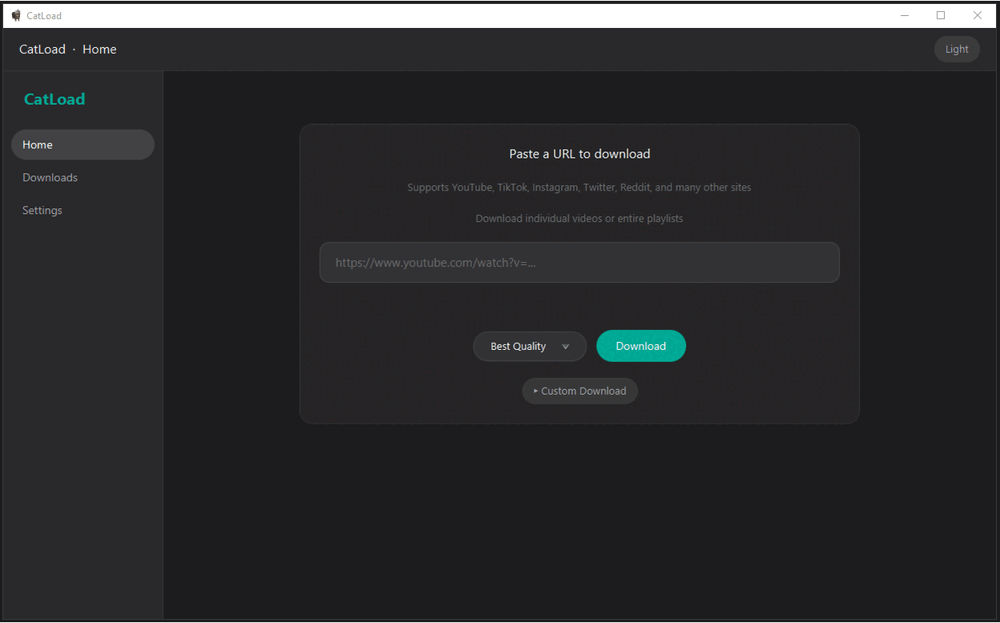
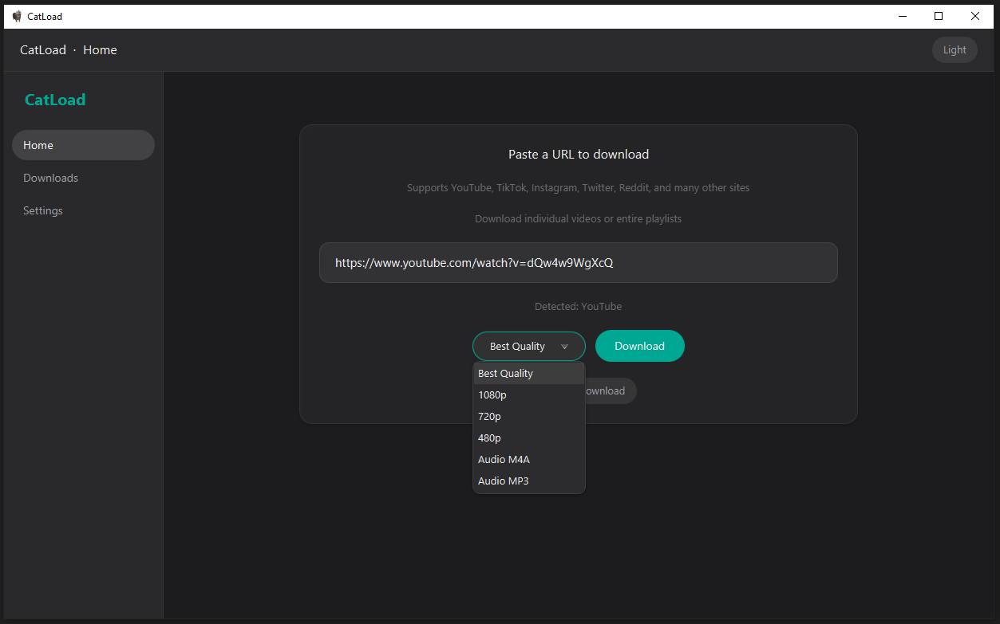
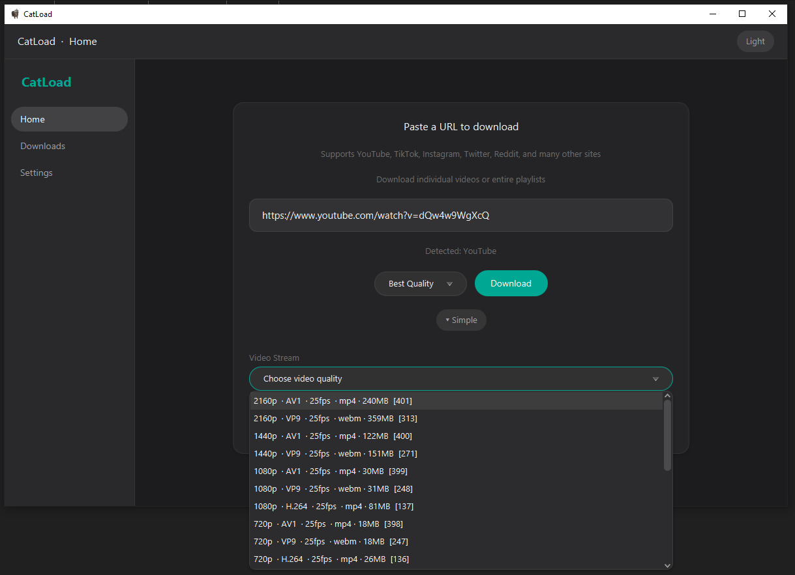
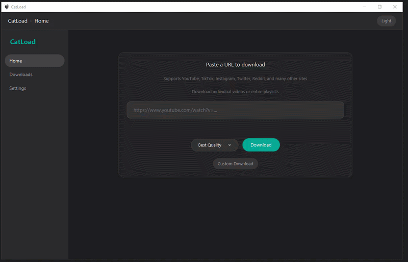
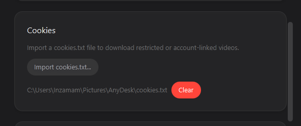
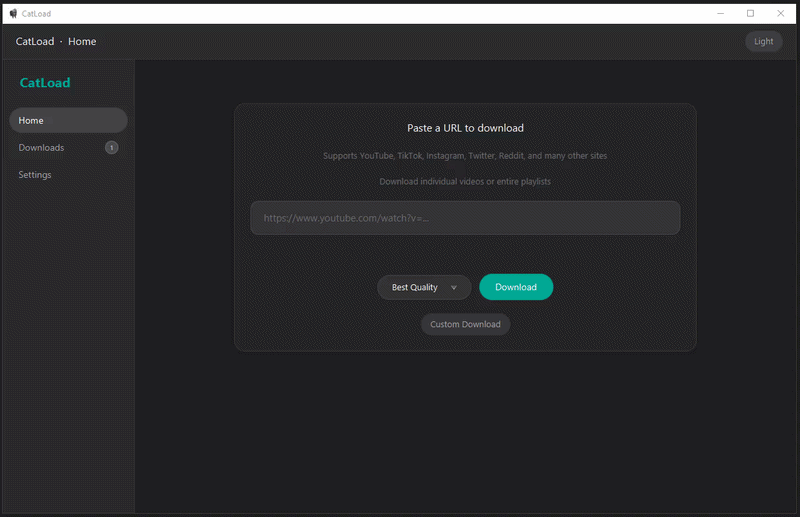
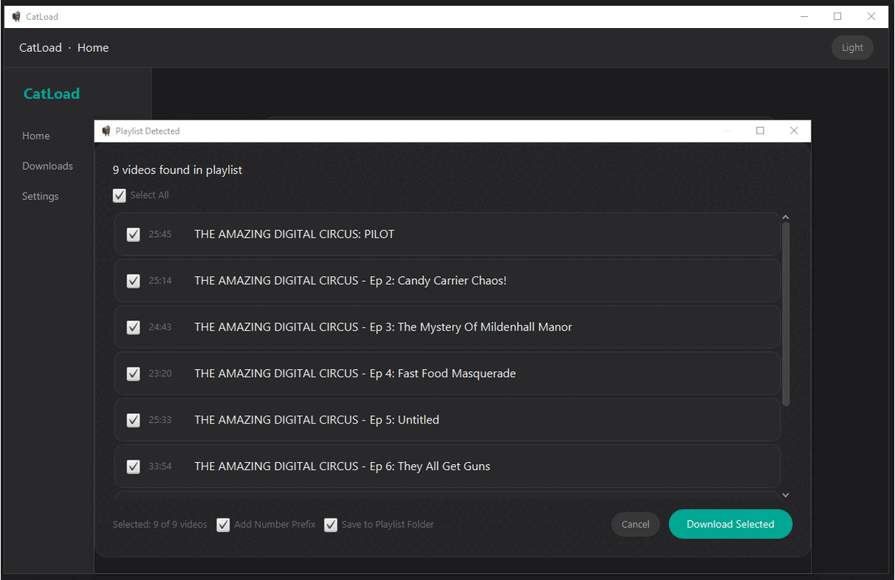
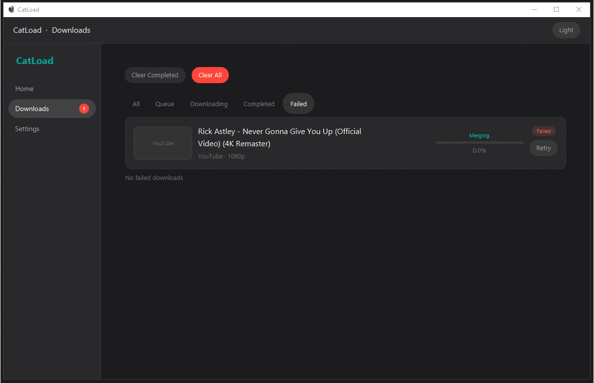
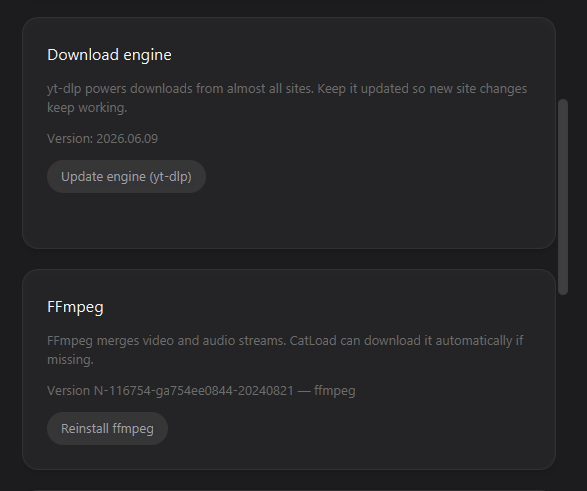
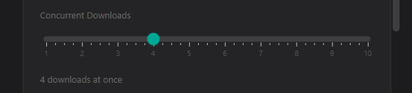

# CatLoad

A free and open-source cross-platform media downloader built with JavaFX 21. Designed to be lightweight, fast, and memory-efficient while supporting videos, audio, and entire playlists.

Supports YouTube, YouTube Shorts, TikTok, Instagram, Reddit and [thousands of other sites](https://github.com/yt-dlp/yt-dlp/blob/master/supportedsites.md) via yt-dlp.

Everything runs locally on your machine - no cloud, no login, no accounts, no tracking and support for Cookies.txt.

 

  

## ⬇️ Download for Windows

---

## 🐧 Download for Linux

## Features

- Custom video/audio stream selection
- Playlist downloading
- Number prefixes for playlists
- Playlist folders
- Cookie support (cookies.txt)
- Concurrent downloads
- Retry and resume downloads
- Automatic yt-dlp updates
- Automatic FFmpeg installation
- Windows & Linux support

### Universal Download
Paste any URL and CatLoad handles the rest.

  

### Custom Stream Selection
Pick specific video and audio formats before downloading.

  

  

### Cookie Support
Import cookies.txt for restricted or account-linked content.

Learn how to get your [cookies.txt](https://www.reddit.com/r/youtubedl/wiki/cookies) file and load it into the app settings. 

Note: When downloading a large number of videos, using a VPN may help reduce the chance of IP rate limiting.

  

### Playlist Link Support 
Optional settings let you automatically add number prefixes and organize downloads into playlist folders.

  

### Number Prefix & Playlist Folders 
"Add number prefixes" Automatically automatically renames downloaded files based on their playlist order.
"Save to playlist folder" Saves downloaded videos inside a folder named after the playlist.

  

  

### Retry & Resume
Automatically retries failed downloads with support for cancellation.

  

### Auto Engine Setup
Update yt-dlp and install FFmpeg directly from the application.

  

### Concurrent Downloads
Supports configurable parallel downloads (up to 10 at once) with a download queue for efficient processing.

  

### Support CatLoad

If CatLoad has been useful to you, consider supporting its development. 

## Tech Stack

- **Java 21** with JavaFX 21
- **yt-dlp** download engine
- **FFmpeg** stream merging
- **OkHttp 4** networking
- **Jackson** JSON serialization
- **Maven** build system

## License

This project is licensed under the GNU Affero General Public License v3.0 (AGPL-3.0).

See the [LICENSE](https://github.com/InzamamShaikh567/CatLoad/blob/main/LICENSE) file for the full license text.
